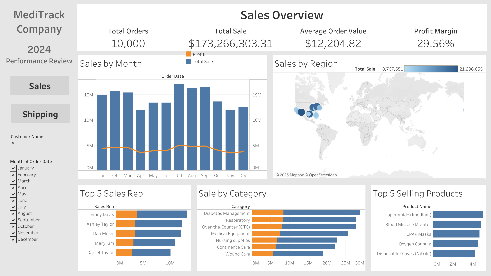
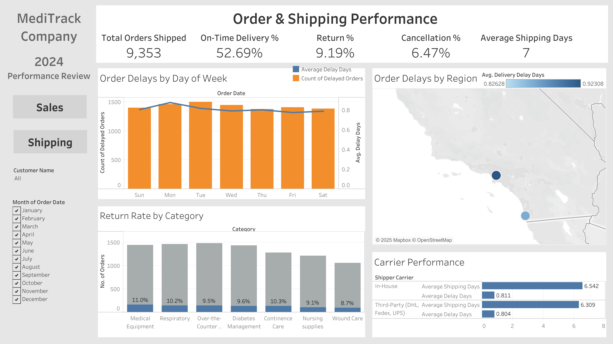

# medical-supply-analytics

# 📊 Medical Supply Analytics Dashboard

## 🚀 Project Overview  
This project provides a **comprehensive analysis of sales and shipping performance** for a medical supply company, **MediFlow Supplies**. The dashboard, built in **Tableau**, helps business users track key performance metrics, improve logistics, and enhance customer satisfaction.  

Additionally, the dataset used in this project was **synthetically generated using Python**, ensuring flexibility and customization to simulate real-world business scenarios.  

---

## 📌 Key Features  
- ✅ **Sales Performance Analysis**: Revenue trends, sales rep performance, and product category insights.  
- ✅ **Order & Shipping Performance**: On-time delivery rates, order cancellations, and carrier efficiency.  
- ✅ **Customer Insights**: Return rates, geographic delivery performance, and behavioral analysis.  
- ✅ **Interactive Filters**: Select time periods (weekly/monthly) and customer mae, toggle between dashboards, and explore trends.  

---

## 📈 Data & Tools Used  
- **Data Source**: **Custom-generated dataset** using Python.  
- **Tech Stack**: **Python, SQL, Tableau**.  
- **Libraries Used for Data Generation**:  
  - `pandas` → Data manipulation  
  - `numpy` → Randomized data generation  
  - `random` → Variability in order outcomes  

---

## 📊 Dashboard Insights  

### **1️⃣ Sales Dashboard**  
- 🔹 **Revenue & Profit Trends** (Line Chart)
- 🔹 **Sales Performance by Region** (Map View)  
- 🔹 **Sales Rep Performance** (Bar Chart)  
- 🔹 **Product Category Analysis** (Stacked Bar Chart)  

### **2️⃣ Shipping Performance Dashboard**  
- 🔹 **Order Delay Performance** (Bar + Line Chart by Weekday)  
- 🔹 **Carrier Performance** (Horizontal Bar: In-House vs. Third-Party)  
- 🔹 **Delivery Performance by Region** (Map View: On-time vs. Delays)  
- 🔹 **Return Rate by Product Category** (Stacked Bar Chart)  

---

## 📜 Dataset Generation  
The dataset was **synthetically created** to simulate real-world sales and shipping operations. Below is a sample of how the dataset was generated in Python:  

```python
import pandas as pd
import numpy as np
import random

# Number of orders
num_orders = 5000

# Generate random data
order_ids = range(1, num_orders + 1)
order_dates = pd.date_range(start="2023-01-01", periods=num_orders, freq="H").strftime("%Y-%m-%d")
product_categories = random.choices(["Medical Equipment", "Surgical Supplies", "Pharmaceuticals", "PPE"], k=num_orders)
order_statuses = random.choices(["Delivered", "Cancelled", "Returned"], weights=[0.8, 0.1, 0.1], k=num_orders)
shipping_carriers = random.choices(["In-House", "Third-Party"], weights=[0.6, 0.4], k=num_orders)
shipping_times = np.random.randint(1, 10, size=num_orders)
delivery_delays = np.random.randint(0, 5, size=num_orders)
return_statuses = [random.choice(["Returned", "Not Returned"]) if status == "Delivered" else "N/A" for status in order_statuses]

# Create DataFrame
df = pd.DataFrame({
    "order_id": order_ids,
    "order_date": order_dates,
    "product_category": product_categories,
    "order_status": order_statuses,
    "shipping_carrier": shipping_carriers,
    "shipping_time_days": shipping_times,
    "delivery_delay_days": delivery_delays,
    "return_status": return_statuses
})

# Save dataset
df.to_csv("data/medical_supply_orders.csv", index=False)
```

The full dataset is available in the folder.

## 📸 Dashboard Screenshots
### **Sales Dashboard**


### **Shipping Performance**


Link of Tableau Public:
https://public.tableau.com/app/profile/claire.yuen/viz/Book1_17404610963610/Sales?publish=yes

## 💡 Future Improvements
- 🚀 Enhance dataset with customer demographics and purchasing behavior for deeper insights.
- 🚀 Automate data pipeline using SQL & Python for real-time updates.
- 🚀 Integrate real-world shipping APIs to track actual delivery performance and make the data more dynamic.

